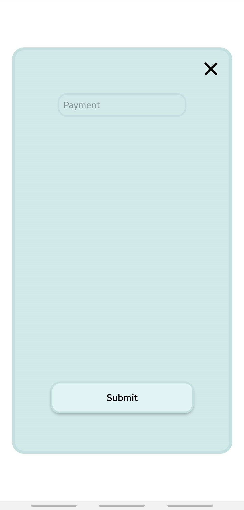

# Finance Tracker

Finance Tracker Mobile App so you can track you finances. Uses Local Storage to store your data, so no data is collected from you.

## Using

Go the the [website](https://expo.dev/@raboro/financetracker) and scan the QR Code.

### Locally
1. Clone the repo
2. Install all dependencies: ``npm install``
3. Run ``npm start`` 
4. Scan QR Code 

## Update
Run ``eas update`` to upload the newest changes to expo.

## Documentation

By entering the app you see the home screen:

By clicking on the ``+`` Button on the bottom you can add a payment:

You can also see your history:

When you click on one payment you can edit or delete it:

## License 
[MIT](https://opensource.org/license/mit/)

## Future Improvements
- Store payments in accounts
- Add properties to payments like: name, data, category...
- Sort payments by all their properties
- Visualize your data with charts